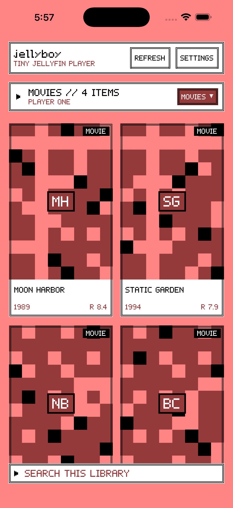
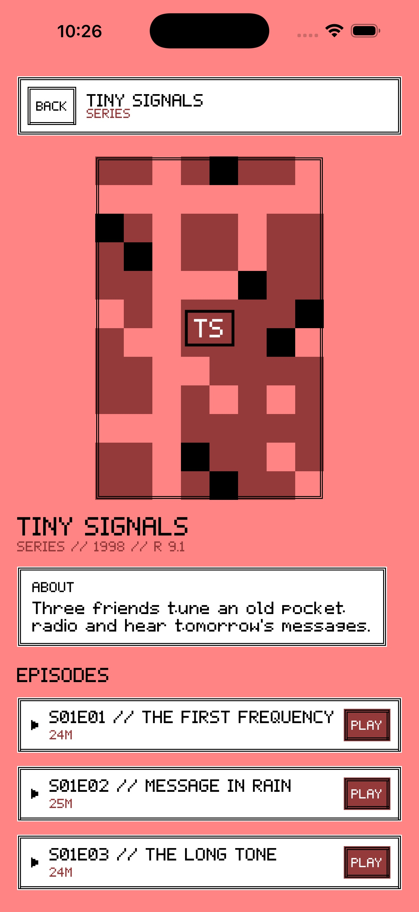
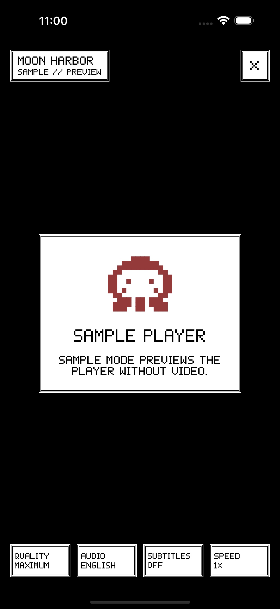
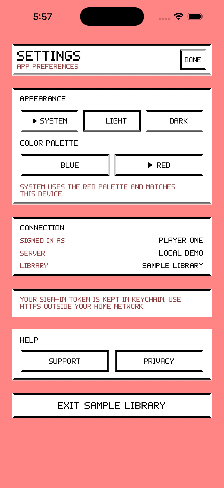
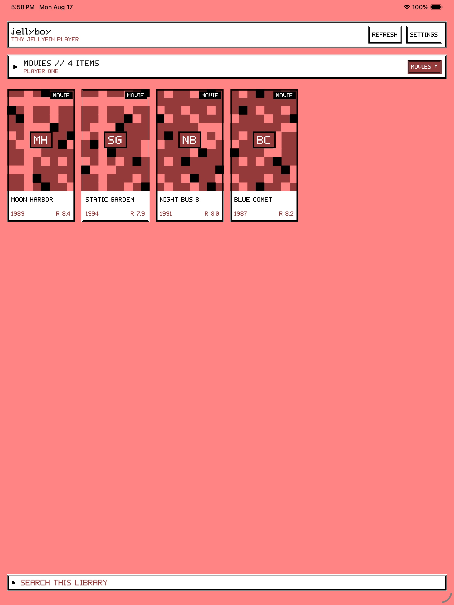
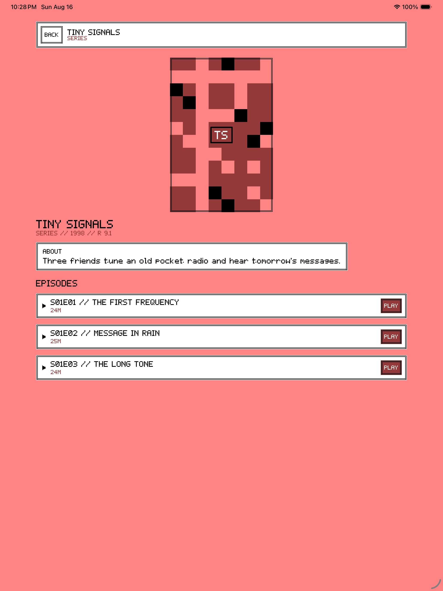
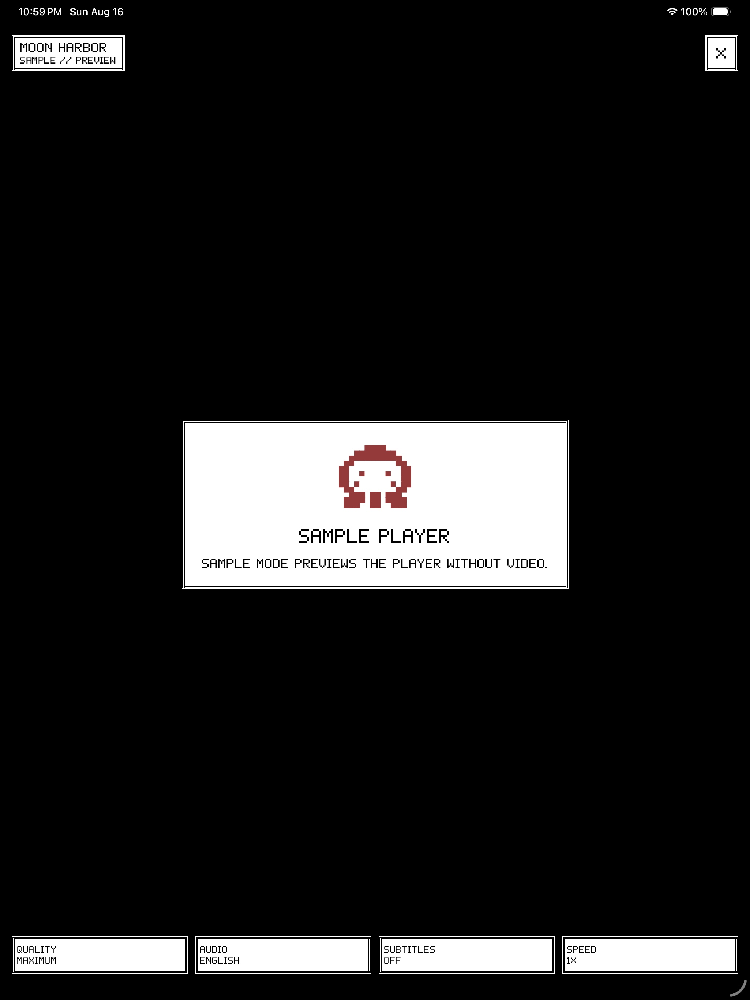
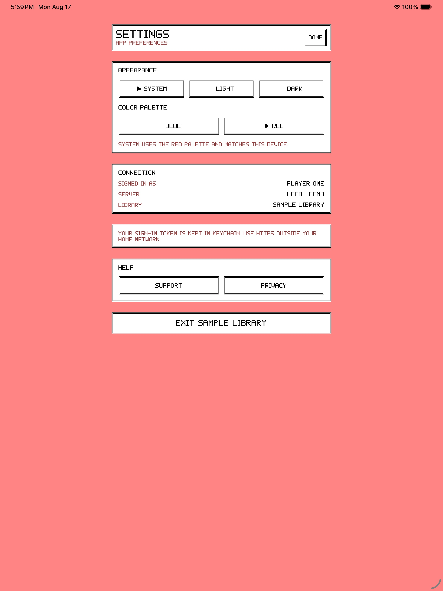

# jellyboy

jellyboy is a small, independent SwiftUI client for personal Jellyfin servers on iPhone, iPad, and macOS. It supports movies, shows and episodes, music, Live TV, authenticated artwork, local downloads, and a dual-engine player without turning the interface into a dashboard.

jellyboy is not affiliated with, endorsed by, or maintained by the Jellyfin project. The [Jellyfin branding guidance](https://jellyfin.org/docs/general/contributing/branding/) permits third-party apps to describe their interoperability without presenting themselves as official clients, but discourages names in the `Jelly[word]` pattern. Public distribution requires separate naming and asset-rights clearance.

## Documentation

- [Support](https://therealparmesh.github.io/jellyboy/support)
- [Privacy policy](https://therealparmesh.github.io/jellyboy/privacy)
- [Release process](distribution/RELEASE.md)
- [App Store metadata](distribution/APP_STORE_METADATA.md)
- [App Review notes](distribution/APP_REVIEW_NOTES.md)
- [TestFlight notes](distribution/TESTFLIGHT_NOTES.md)

## Playback

- Every online play starts with Jellyfin `PlaybackInfo`; the app does not guess a raw media URL.
- `MAXIMUM` uses the official Swiftfin ceiling of 360 Mbps. The fixed video and audio bitrate ladders match Swiftfin, and choices above a known source bitrate stay out of the menu. A reduced limit may intentionally request transcoding. The pinned upstream sources and exact ladders are recorded in [Design/QUALITY_REFERENCE.md](Design/QUALITY_REFERENCE.md).
- The client advertises the containers/codecs handled by VLCKit, plus conservative H.264 and HEVC profile conditions. AV1 is not advertised because software-only decoding is not dependable across the supported devices.
- Compatible Apple streams use `AVPlayer`, which provides native AirPlay. Other direct-play streams use VLCKit with VideoToolbox hardware decoding when available.
- Recovery order is local and low-load first: try the negotiated engine, try VLC against the same URL if AVPlayer rejects it, and only then renegotiate a failed direct source with direct play disabled so Jellyfin can remux or transcode.
- Live TV can direct play its opened HTTP/HLS source through VLC. If Jellyfin supplies a converted HLS URL, AVPlayer is tried first and VLC is the local fallback.
- The player reports the real method and engine (`DIRECT`, `DIRECT STREAM`, or `TRANSCODE`, plus `AV` or `VLC`) rather than labeling every channel only as “live.”
- Quality, speed, audio, and subtitle selectors use the same in-app menu component. Embedded and external text subtitles are supported; Jellyfin can burn bitmap subtitles such as PGS when conversion is required.
- iOS/iPadOS background audio, Lock Screen/Control Center play-pause, seeking, and 10-second skip commands are enabled. Video AirPlay is available on the native AV path; VLC-only media may require Jellyfin conversion before an Apple TV can accept it.

## Library and offline media

- The library picker mirrors the signed-in user's named Jellyfin libraries and loads only the selected library's playable items. `LIVE TV` and `OFFLINE` remain separate utilities. Series open an episode list; channels use a dedicated live action.
- Poster and channel thumbnails are requested with Jellyfin authentication and cached by the system image pipeline.
- Up to three normalized recent server URLs are kept for quick switching. Usernames, passwords, and access tokens are never stored in that history; the active access token is stored in Keychain.
- Downloads use the same official-client bitrate ladders and let the user choose audio and subtitle tracks. `MAXIMUM` copies or remuxes when possible; a reduced cap allows a progressive MP4/MP3 transcode. Text subtitles are saved next to the media, while bitmap subtitles can be burned into a converted download.
- Download manifests omit tokens, network headers, source paths, and transcode URLs. One download or all downloaded media can be removed from the `OFFLINE` entry.

Live TV downloads, EPG/DVR controls, Picture in Picture, background download continuation, watch-state reporting, profile switching, and scrub-preview thumbnails are intentionally outside the current app.

## Game-informed interface

The interface behavior is measured from the English Pokémon Red/Blue game data, not recreated from memory. It uses an original compact pixel typeface, original stepped double-track frames, a filled menu cursor, two-tile menu-row rhythm, immediate menu replacement, and the exact Game Boy Color compatibility palettes for Red and Blue. Cartridge chrome, scanlines, ornamental shadows, spring transitions, and modal dimming are not part of the app.

`LIGHT` uses the selected Red or Blue palette values directly. `DARK` is clearly a derived rearrangement of those same four values because the games do not contain a dark UI mode. `SYSTEM` follows the Apple device while retaining the selected version palette.

| Version | CGB combination | Background palette | RGB555, lightest to darkest    |
| ------- | --------------: | -----------------: | ------------------------------ |
| Red     |              13 |                  4 | `7FFF`, `421F`, `1CF2`, `0000` |
| Blue    |              11 |                 28 | `7FFF`, `7E8C`, `7C00`, `0000` |

The pinned behavioral and palette references plus the implementation rules are recorded in [Design/GAME_REFERENCE.md](Design/GAME_REFERENCE.md). The font glyphs, frame pixels, and jellyfish sprite are original jellyboy constructions rather than copied game tiles. `script/generate_app_icons.swift` keeps the 16-by-16 icon map as its single source of truth and deterministically reproduces `Design/AppIcon.svg` plus every required opaque icon size in the exact Red palette.

## Screenshots

| Device | Library                                              | Series                                             | Player                                             | Settings                                               |
| ------ | ---------------------------------------------------- | -------------------------------------------------- | -------------------------------------------------- | ------------------------------------------------------ |
| iPhone |  |  |  |  |
| iPad   |      |      |      |      |

## Build and verify

Requirements: Xcode 26+, iOS/iPadOS 17+, or macOS 14+. XcodeGen 2.45+, SwiftLint 0.65+, and oxfmt 0.57+ are required by the verifier and release command. Swift Package Manager downloads the pinned VLCKit dependency on the first build.

```sh
./script/build_and_run.sh          # build and open the macOS app
./script/build_and_run.sh --demo   # open the sample library
./script/build_ios.sh              # compile the iOS Simulator target
./script/verify.sh                 # format, lint, test, and build
```

Use `SETTINGS` → `CHANGE SERVER` to return to connection, then select one of the three recent URLs or enter another. Jellyfin often uses local HTTP on port 8096, so user-entered HTTP servers and local-network access are allowed; use HTTPS outside a trusted LAN.

The display name, product name, scheme, client name, documentation, App Store listing, and TestFlight notes use lowercase `jellyboy`. Signed archives and uploads are CLI-only:

```sh
./script/release_ios.sh build
./script/release_ios.sh upload
```

The upload command refuses a dirty tree and reads the App Store Connect private key from outside the repository. See the [release process](distribution/RELEASE.md) for publisher setup, versioning, TestFlight, review access, screenshots, privacy, and rights clearance. jellyboy has no purchases, subscriptions, in-app purchases, or Apple Pay integration.

VLCKit is dynamically embedded under LGPL 2.1-or-later. Preserve its notices and distribution obligations described in [THIRD_PARTY_NOTICES.md](THIRD_PARTY_NOTICES.md).
